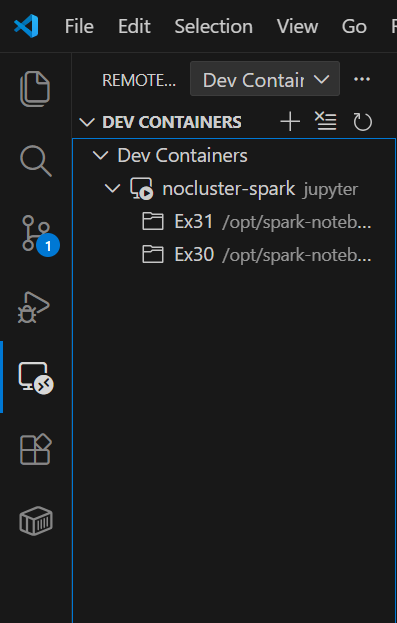

# Local setup of Pyspark without distributed clusters
If you need a full local environment with master and cluster [see here](https://github.com/manisnitt/spark_local_setup)

## Prerequisites
- [docker desktop](https://www.docker.com/products/docker-desktop/)
- [git](https://git-scm.com/install/)

## Instructions
- Create a folder, for example 	`spark_setup`
- Inside `spark_setup` run
```
git clone https://github.com/AleBera03/nocluster-spark
```
- Then inside the cloned project (`nocluster-spark`) run
```
# close current in running container (if it exists)
# build the new one
docker-compose down && docker-compose up -d --build
```
- Now verify that the cointainer *jupyter* is running within **nocluster_setup** (i.e, the name of folder you've created)

## VSCode
In order to open folder inside the container you have to follow these steps:
- install (if you have not the extension yet) [dev container](https://code.visualstudio.com/docs/devcontainers/containers)
- open _remote explorer_ menu and then _dev container_ among drop-down list options
- select _nocluster-spark_ like as showed in the following image

